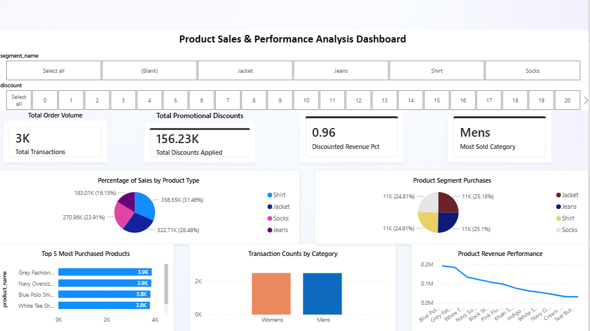

# Product Sales & Performance Analysis Dashboard

## 📋 Project Overview
An end-to-end retail data analytics case study executing data manipulation in Excel, relational database querying in SQL, and dynamic dashboard creation in Power BI. The dashboard helps stakeholders understand customer purchasing behavior, top-performing products, and regional sales performance to optimize future stock orders.

---

## 🎖 Certification & Credentials
* **Credential:** Certified Data Analyst (Excel, SQL & Power BI)
* **Issuing Organization:** AnalytixLabs (https://analytixlabs.co.in)
* **Issue Date:** June 8, 2026
* **Certificate Verification Document:** [Click Here to View Stored PDF](data%20analyst%20certificate.pdf)

---

## 📂 Project Repository Files
* 📊 **Excel Analytics Workbook:** `nithish_ramesh_casestudy.xlsx`
* 🗄️ **SQL Analytical Queries:** `nithish_ramesh.sql`
* 📉 **Power BI Interactive Dashboard:** `nithish_ramesh.pbix`
* 📄 **Official Credential Document:** `data analyst certificate.pdf`

---

## 🛠️ Tools & Technologies Used
* **Microsoft Excel:** Data cleaning, absolute indexing formulas, and structural table lookups.
* **SQL:** Relational query structure, math calculations, and ranking window functions.
* **Power BI Desktop:** ETL processing, DAX modeling, data canvas layouts, and user interactions.

---

## 📊 Dataset Information
The underlying transactional dataset captures operational parameters including:
* Product category and item segment details
* Direct transaction IDs and volume counts
* Margin, base pricing, and discount variations
* Regional consumer sales distributions

---

## 🛠️ Key Solutions & Metrics Completed

### 1. Spreadsheet Engineering (MS Excel)
* **Missing Data Imputation:** Utilized `XLOOKUP` mechanics to fix structural dataset holes across tables.
* **Sales Contribution Metrics:** Formulated absolute logic weights calculating categorical sales margins out of total revenue.
* **Aggregated Performance Reporting:** Calculated **Average Order Value (AOV)** metrics and automated multi-tie quantity drivers using array filters.

### 2. Relational Analytics (SQL)
* Aggregated retail revenue across category fields using `SUM()` and `GROUP BY`.
* Calculated margin volatility using mathematical absolute variations (`ABS`).
* Handled highest discount metrics using ratio filtering calculations.
* Used window functions (`DENSE_RANK()`) to isolate specific performance percentiles (3rd and 4th top-selling categories).

### 3. Interactive Business Intelligence (Power BI)
* Engineered a dynamic reporting engine visualizing Total Transactions, Applied Discounts, and Categorical Sales Proportions.
* Implemented cross-filtering slicers allowing real-time deep-dives by product type and discount bracket.

---

## 💻 Core SQL Implementations

<details>
<summary><b>🔍 View Query 1: Isolating 3rd & 4th Highest-Selling Categories (CTEs & Window Functions)</b></summary>

```sql
WITH RankedCategories AS (
    SELECT 
        category_name,
        SUM(price * qty) AS total_sales,
        DENSE_RANK() OVER (ORDER BY SUM(price * qty) DESC) AS sales_rank
    FROM product_sales
    GROUP BY category_name
)
SELECT 
    sales_rank,
    category_name,
    ROUND(total_sales, 2) AS total_sales
FROM RankedCategories
WHERE sales_rank IN (3, 4);
```
</details>

<details>
<summary><b>📈 View Query 2: Product Highest Discount Percentage Calculation</b></summary>

```sql
SELECT 
    product_name,
    original_price,
    discounted_price,
    ROUND(((original_price - discounted_price) / original_price) * 100, 2) AS discount_percentage
FROM product_pricing
WHERE original_price > 0
ORDER BY discount_percentage DESC
LIMIT 1;
```
</details>

<details>
<summary><b>💰 View Query 3: Total Revenue & Price Fluctuation Metrics</b></summary>

```sql
-- Total revenue for each product category
SELECT 
    category_name,
    ROUND(SUM(price * qty), 2) AS total_revenue
FROM product_sales
GROUP BY category_name
ORDER BY total_revenue DESC;

-- Product with the lowest price fluctuation
SELECT 
    product_name,
    original_price,
    discounted_price,
    ABS(original_price - discounted_price) AS price_fluctuation
FROM product_pricing
ORDER BY price_fluctuation ASC
LIMIT 1;
```
</details>

---

## 📉 Dashboard Preview


---

## 💡 Core Insights Uncovered
* **Discount Elasticity:** Specific product types with heavy margin fluctuations saw high transaction numbers but decreased overall profitability.
* **Regional Disparities:** Consumer sales volume clusters strongly in specific target regions, outlining clear reallocation opportunities.
* **Strategic Growth Categories:** The 3rd and 4th ranked sales categories display excellent average pricing figures, making them ideal targets for marketing campaigns.

---

## ⚙️ Future Enhancements Planned
* Implementing advanced Time-Intelligence DAX metrics for rolling averages.
* Building out predictive forecasting trends for upcoming quarterly stock planning.
* Integrating advanced automated scheduled updates via Power Query.

---
## 📬 Author & Contacts
* **Nithish Ramesh**
* **LinkedIn Profile:** [linkedin.com/in/nithish-rbn](https://www.linkedin.com/in/nithish-rbn)
